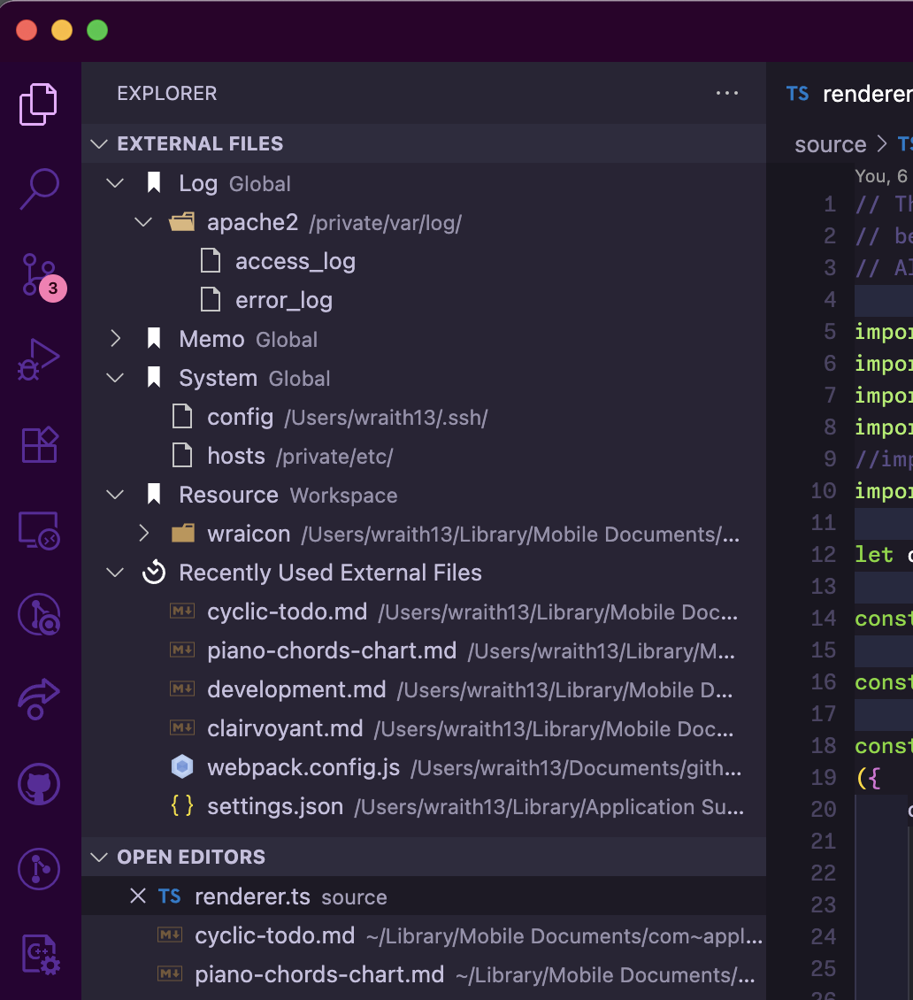

# External Files README

Easy access to external files for vscode.

## Features

* show external files from view on explorer
* You can organize external folders and files with named bookmarks.
* Bookmarks have two scopes: global and workspace.
* "Recently Used External Files" are automatically recorded for each workspace.
* The view can be moved to various locations within VS Code via drag and drop.

## Tutorial

### 0. ⬇️ Install External Files

Show extension side bar within VS Code(Mac:<kbd>Command</kbd>+<kbd>Shift</kbd>+<kbd>X</kbd>, Windows and Linux: <kbd>Ctrl</kbd>+<kbd>Shift</kbd>+<kbd>X</kbd>), type `external-files-vscode` and press <kbd>Enter</kbd> and click <kbd>Install</kbd>. Restart VS Code when installation is completed.

### 1. ⏳ "Recently Used External Files"

When you open a file outside the workspace in VS Code, it is automatically added to the "Recently Used External Files" history, allowing you to access it at any time.

### 2. ✨ Creating Bookmarks

Hover over the External Files view title to reveal the bookmark icon, click it, select the scope for the new bookmark (global or workspace), and enter a name.

### 3. 🔖 Adding Items to Bookmarks

Hover over a bookmark to reveal the plus icon, click it, and select the folder or file you want to add.

### 4. 🔧 Next step

You can change [settings](#extension-settings) by `settings.json`.

Enjoy!

## Extension Settings

This extension contributes the following settings by [`settings.json`](https://code.visualstudio.com/docs/customization/userandworkspace#_creating-user-and-workspace-settings)( Mac: <kbd>Command</kbd>+<kbd>,</kbd>, Windows / Linux: <kbd>File</kbd> -> <kbd>Preferences</kbd> -> <kbd>User Settings</kbd> ):

* `external-files.maxRecentlyFiles`: The maximum number of entries to keep in the "Recently Used External Files" history.

## Release Notes

see ChangLog on [marketplace](https://marketplace.visualstudio.com/items/wraith13.external-files-vscode/changelog) or [github](https://github.com/wraith13/external-files-vscode/blob/master/CHANGELOG.md)

## Support

[GitHub Issues](https://github.com/wraith13/external-files-vscode/issues)

## License

[Boost Software License](https://github.com/wraith13/external-files-vscode/blob/master/LICENSE_1_0.txt)

## Download VSIX file ( for VS Code compatible softwares )

[Releases · wraith13/external-files-vscode](https://github.com/wraith13/external-files-vscode/releases)

## Other extensions of wraith13's work

|Icon|Name|Description|
|---|---|---|
| |[Unsaved Files](https://marketplace.visualstudio.com/items?itemName=wraith13.unsaved-files-vscode)|Easy access to unsaved files for VS Code.|
| |[Bracket Lens](https://marketplace.visualstudio.com/items?itemName=wraith13.bracket-lens)|Show bracket header on closing bracket.|
| |[Open in GitHub Desktop](https://marketplace.visualstudio.com/items?itemName=wraith13.zoombar-vscode)|Open in GitHub Desktop from VS Code.|

See all wraith13's expansions: <https://marketplace.visualstudio.com/publishers/wraith13>
